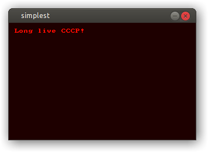

# Эксперименты с Allegro 5 на Си и Обероне

*See English below*

## Установка под Дебиан
```
sudo apt-get install -y liballegro*5.2 liballegro*5-dev
```
или смотри [инструкцию](https://github.com/liballeg/allegro_wiki/wiki/Quickstart).

### Установка под Убунту
```
sudo add-apt-repository ppa:allegro/5.2
sudo apt-get install -y liballegro*5.2 liballegro*5-dev
```

### Установка под Windows
Смотри раздел «Windows» в [следующей инструкции](https://github.com/liballeg/allegro_wiki/wiki/Quickstart).
Скачать и установить MinGW-w64, скачать библиотеки и включаемые файлы Allegro 5 и переместите их в каталоги MinGW.

## Компиляция и запуск
```
cd 1_simplest
make run
```

*Список примеров см. внизу*

-----------

# Allegro 5 experiments in C and Oberon

## Setup on Debian
```
sudo apt-get install -y liballegro*5.2 liballegro*5-dev
```
or check out [the tutorial](https://github.com/liballeg/allegro_wiki/wiki/Quickstart).

### Setup on Ubuntu
```
sudo add-apt-repository ppa:allegro/5.2
sudo apt-get install -y liballegro*5.2 liballegro*5-dev
```

### Setup on Windows
See “Windows” section of [this tutorial](https://github.com/liballeg/allegro_wiki/wiki/Quickstart).
Download and install MinGW-w64, download Allegro 5 libraries and includes and move them to the MinGW folders.

## Compile & Run
```
cd 1_simplest
make run
```

*See the list of examples below*

-----------

## Примеры / Examples

| Имя / Name | Описание / Description |
| --------- | ----------- |
| [1\_simplest](1_simplest/simplest.c) | Создаёт окно с надписью. Creates a window with a sign. |
| [2\_lines](2_lines/lines.c) | Рисует фигуру, которая движется по щелчку мыши. Draws a figure, that moves right upon mouse click. |
| [3\_windows](3_windows/windows.c) | Открывает несколько окон. Opens multiple windows. |
| [4\_expose](4_expose/expose.c) | Перерисовывает раскрытые части окна. Redraws exposed parts of the window. |
